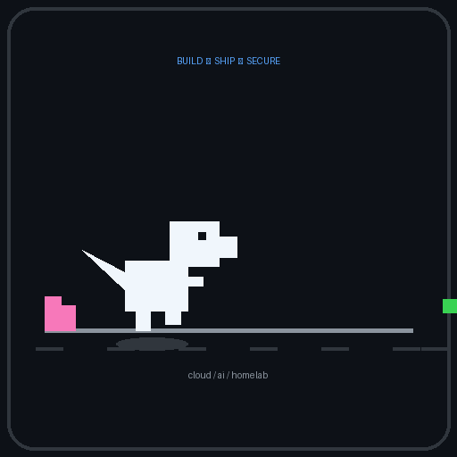

  

<h1 align="center">Hi, I'm Ammaar Rehman</h1>

  <strong>Information Systems student focused on cloud, cybersecurity, AI tools, and infrastructure.</strong>

  <a href="https://ammaarrehman.com">Portfolio</a> ·
  <a href="https://www.linkedin.com/in/ammaarrehman">LinkedIn</a> ·
  <a href="https://github.com/ammaarrehman">GitHub</a>

---

## About me

I'm preparing to transfer to the University of Maryland for Information Systems and I use GitHub to document the projects I build while learning: cloud labs, homelab infrastructure, AI workflow tools, cybersecurity projects, and portfolio websites.

- Incoming Information Systems student at the University of Maryland
- Cloud & AI Ops Intern at NextGen Cyber Initiative
- AWS Certified Cloud Practitioner
- Interested in cloud computing, cybersecurity, AI operations, networking, and public-sector technology
- Building practical projects through personal work and NightStar Labs

---

## Current focus

- Building and documenting my Raspberry Pi homelab
- Improving my personal portfolio website
- Creating cloud infrastructure projects with AWS and Terraform
- Learning networking, Linux, cybersecurity, and monitoring tools
- Building AI-assisted workflows using Claude and Google Workspace

---

## Featured projects

### Claude Intake Triage Assistant

A Claude-powered workflow that turns free-text community help requests into structured, reviewable records.

**Built with:** Claude API, Google Forms, Google Apps Script, Google Sheets, Python

**Highlights:**

- Extracts primary need, secondary needs, urgency, summary, next step, follow-up questions, and human-review flag
- Includes a staff runbook, safety notes, README, screenshots, and demo
- Uses a Python evaluation harness with 15 test cases
- Improved multi-need coverage from 0% to 90%
- Reached 100% classification accuracy across the scoped test set

**Repository:** [claude-intake-triage](https://github.com/ammaarrehman/claude-intake-triage)

---

### Raspberry Pi Homelab

A two-node Raspberry Pi homelab for DNS filtering, monitoring, dashboards, and secure remote access.

**Built with:** Raspberry Pi, Linux, Docker, AdGuard Home, Unbound, Tailscale, Uptime Kuma, Prometheus, Grafana

**Highlights:**

- Local DNS filtering with AdGuard Home
- Recursive DNS resolution with Unbound
- Service monitoring with Uptime Kuma
- Metrics dashboards with Prometheus and Grafana
- Secure remote access with Tailscale
- Documented architecture, setup notes, constraints, and screenshots

---

### AWS Static Site with Terraform

Infrastructure-as-code project for deploying a private S3 static website behind CloudFront.

**Built with:** AWS S3, CloudFront, Origin Access Control, Terraform, ACM, AWS Budgets

**Highlights:**

- Private S3 bucket behind CloudFront
- CloudFront Origin Access Control
- Terraform-based repeatable deployment
- Budget-conscious design using AWS free-tier-friendly choices
- Screenshots and documentation included

---

### Portfolio Website

My personal portfolio site for showcasing projects, experience, and technical growth.

**Built with:** HTML, CSS, JavaScript, GitHub Pages

**Website:** [ammaarrehman.com](https://ammaarrehman.com)

---

## Tools and technologies

### Cloud and infrastructure

### Monitoring and networking

### AI and development

---

## GitHub activity

  

---

## What I'm building toward

I'm working toward cloud, cybersecurity, and AI operations roles where I can build practical systems, document them clearly, and support real users.

My goal is to keep improving through hands-on projects, strong documentation, and honest iteration.

---

  Building practical systems. Documenting the process. Improving one project at a time.

